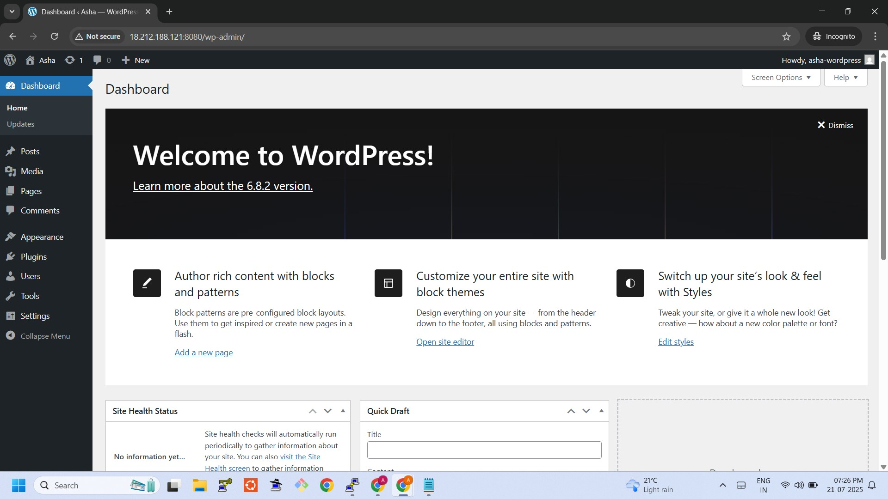

# 🚀 WordPress on Docker Project

This project demonstrates how to run a fully functional WordPress website using Docker and Docker Compose on an AWS EC2 instance.

## 🔧 Stack Used
- Amazon Linux 2023 EC2 Instance
- Docker & Docker Compose
- WordPress 6.8.2
- MySQL 5.7

## 📦 How to Run This Project

1. SSH into your EC2 instance
2. Create a `docker-compose.yml` with the following content:

```yaml
version: '3.8'
services:
  wordpress:
    image: wordpress:latest
    ports:
      - "8080:80"
    environment:
      WORDPRESS_DB_HOST: db
      WORDPRESS_DB_USER: wpuser
      WORDPRESS_DB_PASSWORD: wppassword
      WORDPRESS_DB_NAME: wpdatabase
    volumes:
      - wp_data:/var/www/html
  db:
    image: mysql:5.7
    restart: always
    environment:
      MYSQL_DATABASE: wpdatabase
      MYSQL_USER: wpuser
      MYSQL_PASSWORD: wppassword
      MYSQL_ROOT_PASSWORD: rootpassword
    volumes:
      - db_data:/var/lib/mysql

volumes:
  wp_data:
  db_data:
Start the containers:

bash
Copy
Edit
docker-compose up -d
Visit: http://your-public-ip:8080

📸 Screenshot


👩‍💻 Author
Asha

🔗 GitHub
